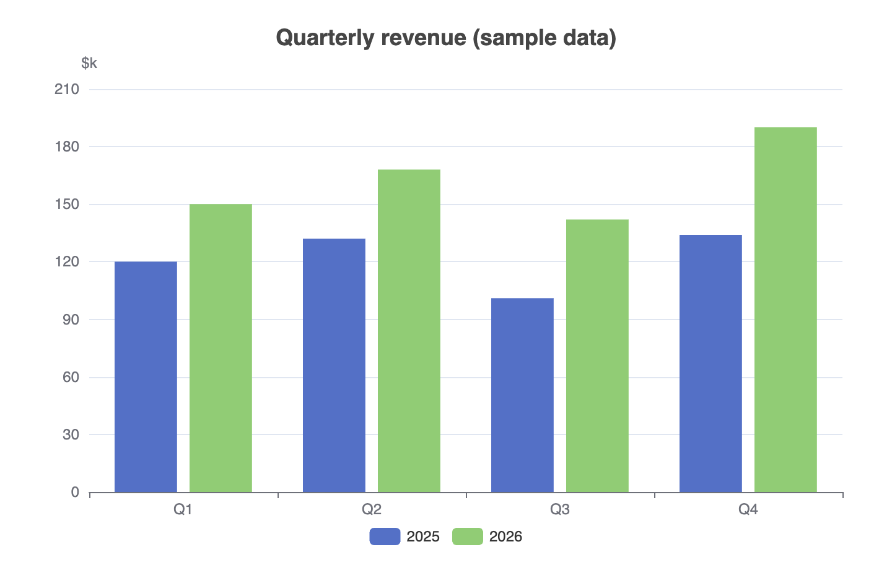
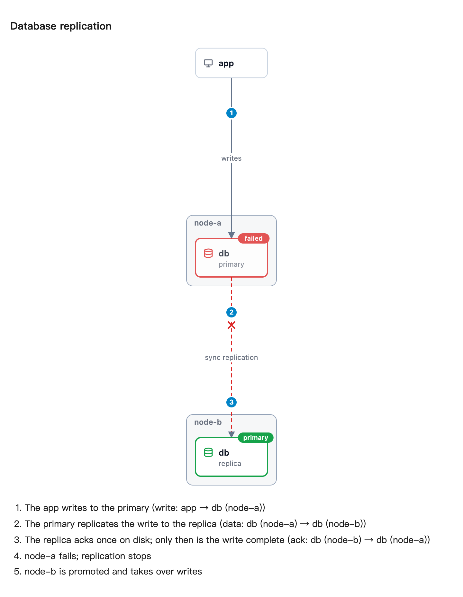
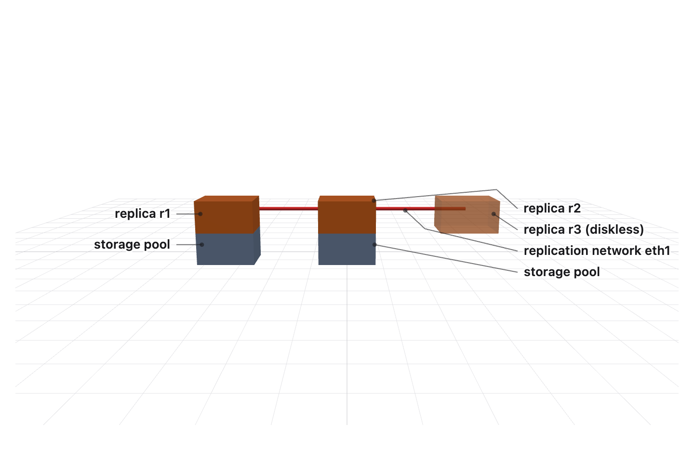
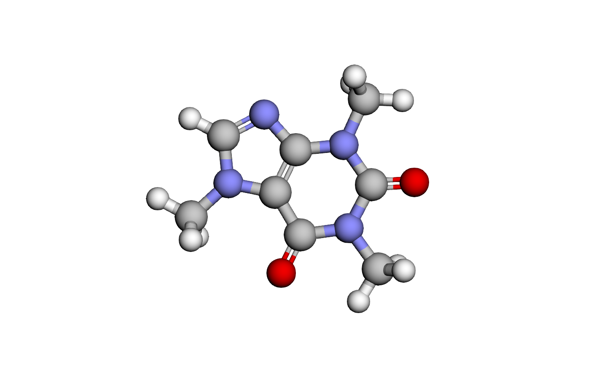
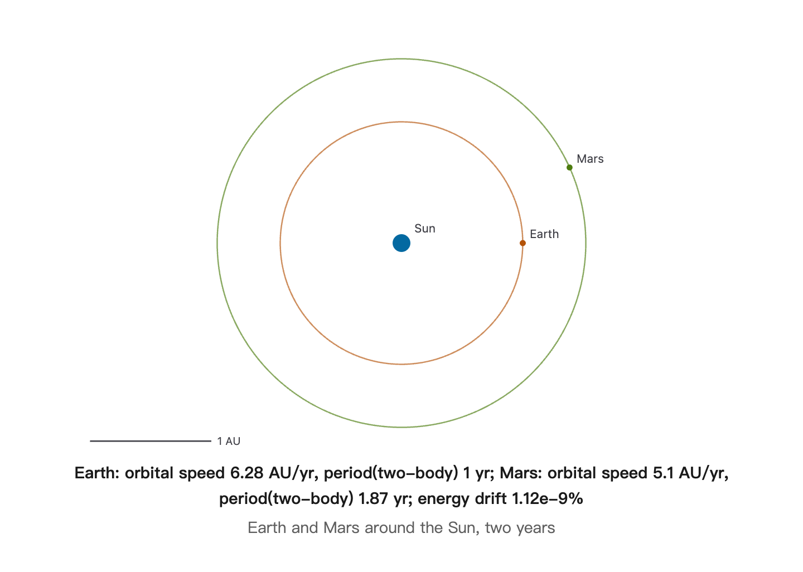
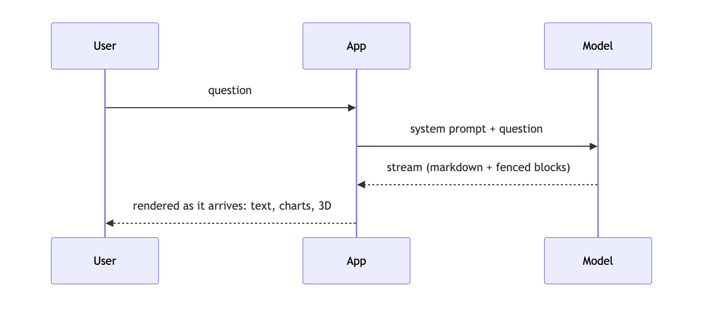
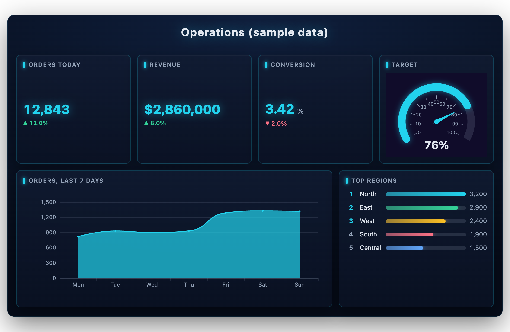

# AIGUI

Render a streaming LLM answer as live UI — markdown, charts, diagrams, maths, 3D, topologies and app-defined cards — in React, Vue or plain DOM.

| | |
| --- | --- |
|  |  |
|  |  |
|  |  |



Every picture above was drawn by AIGUI from a fenced block a model wrote; the data is sample data.

## Install

```sh
pnpm add @ai-gui/core @ai-gui/react      # or @ai-gui/vue, @ai-gui/vanilla
pnpm add @ai-gui/plugin-chart @ai-gui/plugin-mermaid @ai-gui/plugin-katex   # any plugins
```

| Package | |
| --- | --- |
| `@ai-gui/core` | Headless streaming parser, card registry, plugin engine, sanitizer |
| `@ai-gui/react` · `@ai-gui/vue` · `@ai-gui/vanilla` | Framework adapters |
| `@ai-gui/plugin-chart` · `@ai-gui/plugin-bigscreen` · `@ai-gui/plugin-dashboard` | ECharts charts, animated data walls, table + chart panels |
| `@ai-gui/plugin-mermaid` · `@ai-gui/plugin-katex` · `@ai-gui/plugin-highlight` | Diagrams, maths, code |
| `@ai-gui/plugin-topology` · `@ai-gui/plugin-graph` | Infrastructure topologies with playable steps, knowledge graphs |
| `@ai-gui/plugin-scene` · `@ai-gui/plugin-molecule` · `@ai-gui/plugin-map` | 3D scenes, molecules, maps |
| `@ai-gui/plugin-gravity` · `@ai-gui/plugin-motion` · `@ai-gui/plugin-optics` · `@ai-gui/plugin-physics` | Physics figures computed from the conditions |
| `@ai-gui/plugin-solid` · `@ai-gui/plugin-function` · `@ai-gui/plugin-figure` · `@ai-gui/plugin-quote` | Geometry, functions, labelled figures, candlesticks |
| `@ai-gui/plugin-ui` · `@ai-gui/plugin-form` · `@ai-gui/plugin-primitives` · `@ai-gui/plugin-progress` · `@ai-gui/plugin-flashcard` | Generated UI, forms, lists and tables, progress, flashcards |
| `@ai-gui/plugin-citation` · `@ai-gui/plugin-artifact` · `@ai-gui/plugin-evidence` · `@ai-gui/plugin-resultset` | Sources, revisioned documents, host-written provenance and result tables |
| `@ai-gui/plugin-sdk` | Plugin authoring helpers |
| `@ai-gui/openai` · `@ai-gui/anthropic` · `@ai-gui/vercel-ai` | Model stream adapters |
| `@ai-gui/image` · `@ai-gui/openclaw` | Blocks to PNG in a headless browser; for picture-only chat channels |
| `@ai-gui/mcp` · `@ai-gui/cli` · `@ai-gui/live` · `@ai-gui/devtools` | MCP server for agents, the system prompt as a file, server-driven cards, a stream timeline |

## Quick start

```tsx
import { useRef } from "react"
import { buildSystemPrompt } from "@ai-gui/core"
import { AIRenderer } from "@ai-gui/react"
import { chart } from "@ai-gui/plugin-chart"
import { mermaid } from "@ai-gui/plugin-mermaid"

const plugins = [chart(), mermaid()]
const system = buildSystemPrompt({ base: "You are a helpful assistant.", plugins })

export function Answer() {
  const ref = useRef(null)
  async function ask(question: string) {
    const res = await fetch("/api/chat", { method: "POST", body: JSON.stringify({ system, question }) })
    ref.current.reset()
    await ref.current.feed(res.body) // renders as the tokens arrive
  }
  return <AIRenderer ref={ref} plugins={plugins} />
}
```

`buildSystemPrompt` tells the model which blocks it may write; pass `locale: "zh-CN"` for the rules in Chinese. The backend only streams text — any language works.

## In Claude Code

```text
/plugin marketplace add liliang-cn/aigui
/plugin install aigui@aigui
```

Claude can then draw: `aigui_render` returns PNGs, `aigui_open` opens a live page in your browser, `aigui_edit` changes a page in place, `aigui_export` saves it as PNG or PDF. Page text is English unless you ask for another language. See [`@ai-gui/mcp`](./packages/mcp/README.md).

## Docs

- [Full guide](./docs/guide.md) — cards, actions, channels, plugins in depth
- [AGENTS.md](./AGENTS.md) — integrating the SDK, what the model may write, releasing
- Each package's README, under [`packages/`](./packages)

## License

MIT
